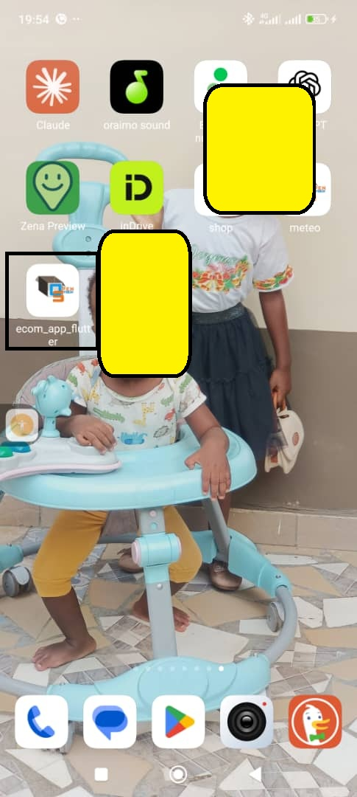
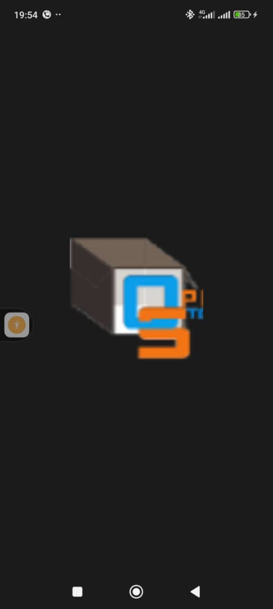

# ecom_app_flutter

1. Changer le logo de l'application
    - Il faut placer l'icon dans le dossier 
      ```yaml
         assets:
            - assets/logo/
            - assets/icon/
      ```
    - Installation du package flutter_launcher_icons
      ```bash
         flutter pub add flutter_launcher_icons
      ```
    - configuration de l'icon dans le fichier pubspec.yaml
        ```yaml
          flutter_launcher_icons:
            android: "launcher_icon"
            ios: true
            image_path: "assets/icon/icon.png"
            min_sdk_android: 21 # Android SDK minimal
            web:
              generate: true
            windows:
              generate: true
            macos:
              generate: true
        ```
      - Exécuter la commande suivante pour générer l'icon
        ```bash
          flutter pub run flutter_launcher_icons
        ```
      Cela aura pour effet de changer l'icon de l'application sur toutes les plateformes (Android, iOS, Web, Windows, MacOS). <br/>
       <br>
2. Changer le splash de l'application
   - Installation de la dependance
     - flutter pub add flutter_native_splash
   - Création du fichier de configuration à la racine du projet flutter_native_splash.yaml
   - Récupération de toutes les images contenue dans le fichier asset en modifiant le fichier pubspec.yaml
     ```yaml
      flutter:
        uses-material-design: true
        assets:
          - assets/logo/
          - assets/icon/
      ```
   - Execution de la commande pour générer les ressources
      ```bash
          dart run flutter_native_splash:create
      ```
      <br/> <br>
3. Mise en place du routage <br/>
Le routage se fait dans le point d'entrée de l'application (main.dart). <br/>
Il se fait comme suit :
```dart
  Widget build(BuildContext context) {
      return MaterialApp(
        //masquer la barre de debug
        debugShowCheckedModeBanner: false,
        // routage
        routes: {
          "/": (context) => HomePage(),
          "/customers": (context) => CustomerPage(),
          "/bills": (context) => BillsPage(),
          "/inventories": (context) => InventoriesPage(),
        },
      );
    }
```
4. Mise en place du Menu
    - Comment naviger entre les pages
   ```dart
      Navigator.pushNamed(context, "${route}");
   ```
    - Menu
      Pour mettre en place le menu il faut d'abord réaliser un draweritem qui servira au templace du menu
    ```dart
      Widget build(BuildContext context) {
            return ListTile(
              leading: itemIcon,
              trailing: Icon(Icons.arrow_forward),
              title: Text("${title}"),
              onTap: () {
                // fermer le menu drawer
                Navigator.of(context).pop();
                // naviguer vers la route
                Navigator.pushNamed(context, "${route}");
              },
            );
        }
    ```
    - Barre de navigation
      La barre de navigation se fait grace au menu drawer
    ```dart
      Widget build(BuildContext context) {
        return Drawer(
          child: Column(
            children: [
    
              //mise en place du menu
              DrawerItem(
                  title: "Accueil",
                  itemIcon: Icon(
                      Icons.home,
                      color: Theme.of(context).primaryColor,
                    ),
                  route: "/"
              ),
              Divider(
                height: 0.5,
                color: Theme.of(context).primaryColor,
              ),
              DrawerItem(
                  title: "Customer",
                  itemIcon: Icon(
                    Icons.verified_user,
                    color: Theme.of(context).primaryColor,
                  ),
                  route: "/customer"
              ),
              Divider(
                height: 0.5,
                color: Theme.of(context).primaryColor,
              ),
              DrawerItem(
                  title: "Bills",
                  itemIcon: Icon(
                    Icons.list_alt,
                    color: Theme.of(context).primaryColor,
                  ),
                  route: "/bills"
              ),
              Divider(
                height: 0.5,
                color: Theme.of(context).primaryColor,
              ),
              DrawerItem(
                  title: "Inventories",
                  itemIcon: Icon(
                    Icons.inventory,
                    color: Theme.of(context).primaryColor,
                  ),
                  route: "/inventories"
              ),
            ],
          ),
        );
    }
    ```
    - Entête header
        L'entête header se met en place grace au widget DrawerHeader
        ```dart
          return DrawerHeader(
              child: Row(
                mainAxisAlignment: MainAxisAlignment.spaceBetween,
                children: [
                  CircleAvatar(
                    // backgroundColor: Colors.transparent,
                    backgroundImage: AssetImage("assets/logo/reactiv.png"),
                    radius: 60,
                  ),
                  Text("Menu application")
                ],
              ),
              decoration: BoxDecoration(
                gradient: LinearGradient(
                  colors: [
                    Colors.white,
                    Theme.of(context).primaryColor,
                  ],
                ),
              ),
           );
        ```
      - Utilisation de l'entête header
    ```dart
      Widget build(BuildContext context) {
        return Drawer(
          child: Column(
            children: [
              // appel de l'entete du menu
              EnteteMenuDrawerHeader(),
    
              //mise en place du menu
              DrawerItem(
                  title: "Accueil",
                  itemIcon: Icon(
                      Icons.home,
                      color: Theme.of(context).primaryColor,
                    ),
                  route: "/"
              ),
              Divider(
                height: 0.5,
                color: Theme.of(context).primaryColor,
              ),
              DrawerItem(
                  title: "Customer",
                  itemIcon: Icon(
                    Icons.verified_user,
                    color: Theme.of(context).primaryColor,
                  ),
                  route: "/customer"
              ),
              Divider(
                height: 0.5,
                color: Theme.of(context).primaryColor,
              ),
              DrawerItem(
                  title: "Bills",
                  itemIcon: Icon(
                    Icons.list_alt,
                    color: Theme.of(context).primaryColor,
                  ),
                  route: "/bills"
              ),
              Divider(
                height: 0.5,
                color: Theme.of(context).primaryColor,
              ),
              DrawerItem(
                  title: "Inventories",
                  itemIcon: Icon(
                    Icons.inventory,
                    color: Theme.of(context).primaryColor,
                  ),
                  route: "/inventories"
              ),
            ],
          ),
        );
    }
    ```
    
5. Création des pages
   - Page customer
   - Page Inventories
   - Bills